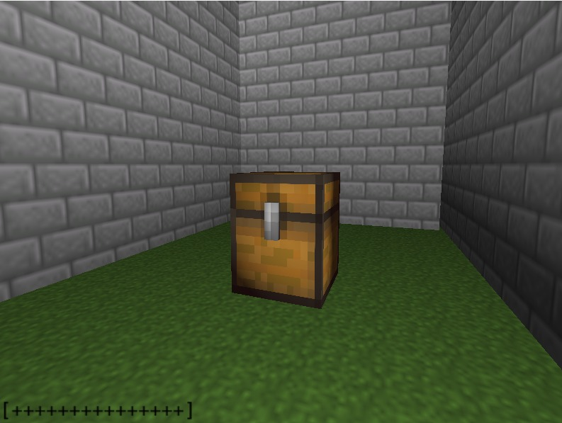
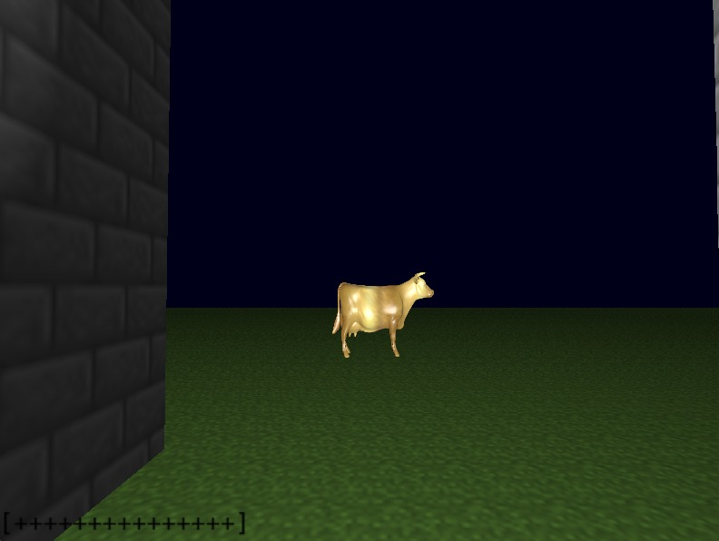

# CowQuest

Trabalho final de Fundamentos de Computação Gráfica (2024/2)

O jogo desenvolvido se chama *CowQuest*. 

O objetivo é escapar do labirinto dentro de um tempo que é determinado pela “fome” do personagem, que precisa procurar por baús que contenham alimento  e chegar até a vaca dourada, localizada em sua saída.

## Contribuições da dupla
**Gabriel**
- Modularização do projeto
- Mapeamento de texturas 
- Animação
- Criação dos modelos de iluminação
- Testes de Colisão
- Interpolação de Phong e Gouraud
- Câmera livre e look-At
- Recorte dos ".obj" utilizando MeshLab
- Telas de Vitória e Derrota

**Maximus**
- Mapeamento de texturas
- Animação 
- Ajuste de parâmetros de iluminação de Blinn-Phong
- Refatorações na classe Game e nos arquivos de shader
- Automatização do carregamento de texturas

## Descrição do processo de desenvolvimento

**Malhas poligonais complexas** - todos os objetos foram construídos utilizando malhas de triângulos, da mesma maneira feita nos laboratórios.

**Transformações geométricas controladas pelos usuários** - a abertura do baú ocorre quando o usuário está próximo o suficiente e pressiona a tecla espaço.

**Câmera livre e look-at** - a câmera livre padrão do jogo é a câmera livre, mas ao estar próximo da vaca, é possível pressionar a tecla "l" para ativar a câmera look-at em sua direção.

**Múltiplas instâncias de objetos** - o baú é copiado múltiplas vezes com diferentes posições.

**Testes de intersecções:**
- Cubo-Cubo: jogador com as paredes
- Cubo-Esfera: jogador com a vaca
- Raio-Cubo: jogador com os baús
  
**Modelo de iluminação difusa** - todas as paredes do labrinto e o chão possuem iluminação difusa.

**Modelo de iluminação de Blinn-Phong** - os baús e a vaca dourada possuem iluminação de Blinn-Phong.

**Mapeamento de texturas em todos os objetos** - as texturas são mapeadas a partir das imagens dentro da pasta "textures", definidas para cada objeto.

**Movimentação com curva Bézier cubica** - A movimentação da vaca pastando é feita através de uma curva de bezier cubica.

**Animações baseadas no tempo** - A abertura do baú é feita através de uma animação baseada em tempo.

## Funcionamento da aplicação

## Manual descrevendo atalhos
W, A, S, D - movimenta o jogador para frente, para a esquerda, para trás e para a direita, respectivamente. 
Shift - faz o jogador se movimentar mais rápido
L - ativa a câmera look-at, que foca na vaca dourada.
Space - abertura do baú
ESC - fecha o jogo
Espaço - abre o baú, caso o jogador esteja próximo o suficiente.

## Compilação da aplicação
Windows
===================================
Para compilar e executar este projeto no Windows, você possui duas
opções para compilação:

--- Windows com Code::Blocks
-------------------------------------------
Baixe a IDE Code::Blocks em http://codeblocks.org/ e abra o arquivo
"Laboratorio_X.cbp".

**ATENÇÃO**: os "Build targets" padrões (Debug e Release) estão configurados
para Code::Blocks versão 20.03 ou superior, que utiliza MinGW 64-bits. Se você
estiver utilizando versões mais antigas do Code::Blocks (17.12 ou anteriores)
você precisa alterar o "Build target" para "Debug (CBlocks 17.12 32-bit)" ou
"Release (CBlocks 17.12 32-bit)" antes de compilar o projeto.

--- Windows com VSCode (Visual Studio Code)
-------------------------------------------
1) Instale o VSCode seguindo as instruções em https://code.visualstudio.com/ .

2) Instale o compilador GCC no Windows seguindo as instruções em
https://code.visualstudio.com/docs/cpp/config-mingw#_installing-the-mingww64-toolchain .

Alternativamente, se você já possui o Code::Blocks instalado no seu PC
(versão que inclui o MinGW), você pode utilizar o GCC que vem com esta
instalação no passo 5.

3) Instale o CMake seguindo as instruções em https://cmake.org/download/ .
Alternativamente, você pode utilizar algum package manager do
Windows para fazer esta instalação, como https://chocolatey.org/ .

4) Instale as extensões "ms-vscode.cpptools" e "ms-vscode.cmake-tools"
no VSCode. Se você abrir o diretório deste projeto no VSCode,
automaticamente será sugerida a instalação destas extensões (pois
estão listadas no arquivo ".vscode/extensions.json").

5) Abra as configurações da extensão cmake-tools (Ctrl-Shift-P e
busque por "CMake: Open CMake Tools Extension Settings"), e adicione o
caminho de instalação do GCC na opção de configuração "additionalCompilerSearchDirs".

Por exemplo, se você quiser utilizar o compilador MinGW que vem junto
com o Code::Blocks, pode preencher o diretório como
"C:\Program Files\CodeBlocks\MinGW\bin" (verifique se este é o local
de instalação do seu Code::Blocks).

6) Clique no botão de "Play" na barra inferior do VSCode para compilar
e executar o projeto. Na primeira compilação, a extensão do CMake para
o VSCode irá perguntar qual compilador você quer utilizar. Selecione
da lista o compilador GCC que você instalou com o MSYS/MinGW.

Veja mais instruções de uso do CMake no VSCode em:

https://github.com/microsoft/vscode-cmake-tools/blob/main/docs/README.md

Linux
===================================
Para compilar e executar este projeto no Linux, primeiro você precisa instalar
as bibliotecas necessárias. Para tanto, execute o comando abaixo em um terminal.
Esse é normalmente suficiente em uma instalação de Linux Ubuntu:

    sudo apt-get install build-essential make libx11-dev libxrandr-dev \
                         libxinerama-dev libxcursor-dev libxcb1-dev libxext-dev \
                         libxrender-dev libxfixes-dev libxau-dev libxdmcp-dev

Se você usa Linux Mint, talvez seja necessário instalar mais algumas bibliotecas:

    sudo apt-get install libmesa-dev libxxf86vm-dev

Após a instalação das bibliotecas acima, você possui várias opções para compilação:

--- Linux com Makefile
-------------------------------------------
Abra um terminal, navegue até a pasta "Laboratorio_0X_Codigo_Fonte", e execute
o comando "make" para compilar. Para executar o código compilado, execute o
comando "make run".

--- Linux com CMake
-------------------------------------------
Abra um terminal, navegue até a pasta "Laboratorio_0X_Codigo_Fonte", e execute
os seguintes comandos:

    mkdir build  # Cria diretório de build
    cd build     # Entra no diretório
    cmake ..     # Realiza a configuração do projeto com o CMake
    make         # Realiza a compilação
    make run     # Executa o código compilado

--- Linux com VSCode
-------------------------------------------

1) Instale o VSCode seguindo as instruções em https://code.visualstudio.com/ .

2) Instale as extensões "ms-vscode.cpptools" e "ms-vscode.cmake-tools"
no VSCode. Se você abrir o diretório deste projeto no VSCode,
automaticamente será sugerida a instalação destas extensões (pois
estão listadas no arquivo ".vscode/extensions.json").

3) Clique no botão de "Play" na barra inferior do VSCode para compilar
e executar o projeto. Na primeira compilação, a extensão do CMake para
o VSCode irá perguntar qual compilador você quer utilizar. Selecione
da lista o compilador que você deseja utilizar.

Veja mais instruções de uso do CMake no VSCode em:

https://github.com/microsoft/vscode-cmake-tools/blob/main/docs/README.md

--- Linux com Code::Blocks
-------------------------------------------
Instale a IDE Code::Blocks (versão Linux em http://codeblocks.org/), abra o
arquivo "Laboratorio_X.cbp", e modifique o "Build target" de "Debug" para "Linux".

macOS
===================================
Para compilar e executar esse projeto no macOS, primeiro você precisa instalar o
HOMEBREW, um gerenciador de pacotes para facilitar a instação de bibliotecas. O
HOMEBREW pode ser instalado com o seguinte comando no terminal:

    /usr/bin/ruby -e "$(curl -fsSL https://raw.githubusercontent.com/Homebrew/install/master/install)"

Após a instalação do HOMEBREW, a biblioteca GLFW deve ser instalada. Isso pode
ser feito pelo terminal com o comando:

    brew install glfw

--- macOS com Makefile
-------------------------------------------
Abra um terminal, navegue até a pasta "Laboratorio_0X_Codigo_Fonte", e execute
o comando "make -f Makefile.macOS" para compilar. Para executar o código
compilado, execute o comando "make -f Makefile.macOS run".

Observação: a versão atual da IDE Code::Blocks é bastante desatualizada pra o
macOS. A nota oficial dos desenvolvedores é: "Code::Blocks 17.12 for Mac is
currently not available due to the lack of Mac developers, or developers that
own a Mac. We could use an extra Mac developer (or two) to work on Mac
compatibility issues."

Após baixar os softwares necessários, somente é necessário clicar Shift+F5 no VS code ou usar o comando `make run`